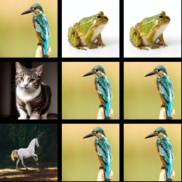

# Project Overview

Welcome to our repository! This project is structured to facilitate the pre-training, fine-tuning, and evaluation of language models (LMs) and vision-language models (VLMs). Below is an overview of the main components of the repository:

To use this project with imports across directories, run
```bash 
pip install -e . 
```
from the root folder. 

## LM-Train
LM-Train contains code written entirely by us for pre-training small GPT-2 size language models. This section is dedicated to the initial training phase using synthetic or real text data.

## Data
Data is a module entirely written by us for generating synthetic data. This section includes scripts and tools to create datasets that can be used for training and evaluating models.

## MM-Train
MM-Train contains our custom code for integrating image encoders with pre-trained language models. This section is dedicated to fine-tuning vision-language models (VLMs) to effectively process and understand multimodal inputs.

## Eval
Eval includes our proprietary scripts and tools for assessing the performance of both language models and vision-language models. This section provides resources for conducting comprehensive evaluations on text-only and multimodal tasks.

# Repository Structure

## LM-Train
This folder contains:
- Scripts for pre-training GPT-2 models.
- Configuration files for setting up the training environment.
- Utilities for data preprocessing and augmentation.

## Data
This folder includes:
- Scripts for generating synthetic datasets.
- Tools for data augmentation and preprocessing.
- Sample datasets for quick testing and validation.

Text-Only Version
```
| bird | frog | frog |
| cat | bird | bird |
| horse | bird | bird |
The grid above is size 3 by 3. Each cell contains an object from ['horse', 'bird', 'cat', 'frog'].
What object is in row 2, column 2? A: bird
What object is in row 0, column 1? A: frog
What object is in row 0, column 0? A: bird
What object is in row 1, column 0? A: cat
What object is in row 1, column 1? A: bird
What object is in row 0, column 2? A: frog
What object is in row 2, column 1? A: bird
What object is in row 1, column 2? A: bird
What object is in row 2, column 0? A: horse
```

Image-Only Version
```

The grid above is size 3 by 3. Each cell contains an object from ['horse', 'bird', 'cat', 'frog'].
What object is in row 2, column 2? A: bird
What object is in row 0, column 1? A: frog
What object is in row 0, column 0? A: bird
What object is in row 1, column 0? A: cat
What object is in row 1, column 1? A: bird
What object is in row 0, column 2? A: frog
What object is in row 2, column 1? A: bird
What object is in row 1, column 2? A: bird
What object is in row 2, column 0? A: horse
```


## MM-Train
This folder comprises:
- Code for integrating image encoders with pre-trained language models.
- Scripts for fine-tuning vision-language models.
- Configuration files for multimodal training setups.

## Eval
This folder consists of:
- Evaluation scripts for both language-only and multimodal tasks.
- Benchmark datasets for standardized evaluation.
- Tools for analyzing and visualizing evaluation results.

# To Do
- [x] Get pretraining for GPT-2 on TinyStories working in LM-Train.
- [x] Get pretraining for GPT-2 on synthetic data -> vibe eval for good performance
- [x] Get training this model with a CLIP encoder, let's call it GPT-2v, working in MM-Train.
- [x] Different LR for different components
- [x] Evaluate this model on:
    - [x] Language-only tasks.
    - [x] Multimodal tasks.

# Ablations
- [ ] Scale # images v/s # q/a per images
- [ ] Multi-instruction data v/s Single Instruction Data